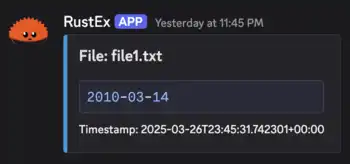

<!-- markdownlint-disable MD036 -->

# RustEx


Rust application that monitors files for changes (text appending) and sends them to a Discord webhook.
Perfect for monitoring logs or other text files.

## Table of Contents

- [RustEx](#rustex)
  - [Table of Contents](#table-of-contents)
  - [Features](#features)
  - [Installation](#installation)
    - [SystemD Service](#systemd-service)
    - [Manual](#manual)
    - [Compile from Source](#compile-from-source)
  - [Usage](#usage)
  - [Discord](#discord)

## Features

- Monitor multiple files
- Regex matching
- Discord webhook integration

## Installation

### SystemD Service

Quick installation:

```bash
curl -sSL https://raw.githubusercontent.com/stenstromen/rustex/main/install.sh | sudo bash
```

See [INSTALL.md](./INSTALL.md) for detailed installation instructions.

Tested on:

- Ubuntu 22.04
- Ubuntu 24.04

### Manual

1. Fetch the latest release from the [Releases](https://github.com/stenstromen/rustex/releases/latest) page.
2. Extract the tarball.

### Compile from Source

```bash
cargo build --release
```

## Usage

1. Create a config.yaml file.
1. Run the application.

```yaml
# config.yaml
---
webhook_url: https://discord.com/api/webhooks/.../...
files:
  - filename: /path/to/file1.log
    regex: ^\d{4}-\d{2}-\d{2}$
  - filename: /path/to/file2.log
    regex: ^\w+\s\w+$
  - filename: /path/to/file3.log
    regex: ERROR.*
```

```bash
./rustex config.yaml
```

## Discord


